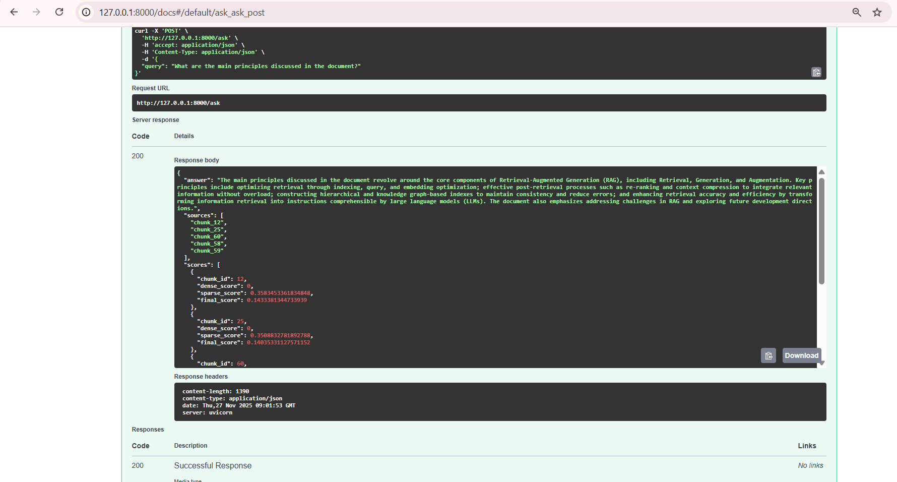

# Hybrid RAG System (BM25 + Dense + Cross-Encoder + LLM)

This project implements a **Hybrid Retrieval-Augmented Generation (RAG)** system over a multi-page PDF.

It combines:

- **Sparse retrieval** using BM25  
- **Dense retrieval** using sentence-transformer embeddings + FAISS  
- A **custom hybrid ranking formula** (BM25 + dense + overlap bonus)  
- **Cross-encoder reranking** for fine-grained relevance  
- Final **answer generation via an LLM** (`gpt-4.1-mini`)  
- A **FastAPI** endpoint `POST /ask` that exposes the full pipeline

The API returns:

- `answer` – generated answer using top-ranked context  
- `sources` – chunk IDs used as context (e.g. `"chunk_12"`)  
- `scores` – per-chunk dense, sparse, and final scores  
- `latency_ms` – end-to-end latency

---

## 1. Setup Instructions

### 1.1. Project structure

From the overall root:

```text
HYBRID_RAG_PROJECT/
  backend/
    app/
      __pycache__/
      main.py          # FastAPI app, /ask endpoint
    data/
      corpus.pdf       # Multi-page PDF (>= 5 pages)
    rag/
      __pycache__/
      __init__.py
      bm25_store.py
      chunker.py
      config.py
      embeddings.py
      pdf_loader.py
      pipeline.py
      reranker.py
      retriver.py      # hybrid_fusion function
      vector_store.py
    evaluation.py      # Hit@5 / MRR@5 / latency evaluation
    README.md
    requirements.txt
  venv/                # Python virtualenv
```

### 1.2. Create and activate virtual environment (Windows PowerShell)

```powershell
PS C:\...\HYBRID_RAG_PROJECT> python -m venv venv
PS C:\...\HYBRID_RAG_PROJECT> .\venv\Scripts\Activate
(venv) PS C:\...\HYBRID_RAG_PROJECT> cd backend
```

### 1.3. Install dependencies

From `backend`:

```powershell
(venv) PS C:\...\HYBRID_RAG_PROJECT\backend> pip install -r requirements.txt
```

### 1.4. Configure the PDF

Place your chosen **multi-page PDF (min 5 pages)** at:

```text
backend/data/corpus.pdf
```

Check `rag/config.py`:

```python
# rag/config.py
import os

BASE_DIR = os.path.dirname(os.path.dirname(__file__))
DATA_DIR = os.path.join(BASE_DIR, "data")

PDF_PATH = os.path.join(DATA_DIR, "corpus.pdf")
```

### 1.5. OpenAI API key (for LLM)

Create a `.env` file **inside `backend/`**:

```env
OPENAI_API_KEY=sk-xxxxxxxxxxxxxxxxxxxxxxxx
```

`rag/pipeline.py` loads this via:

```python
from dotenv import load_dotenv
load_dotenv()
```

If `OPENAI_API_KEY` is missing, the system falls back to a placeholder answer that simply returns the top context snippets (useful for testing retrieval without an LLM).

---

## 2. Architecture Diagram

```text
backend/docs/hybrid_rag_architecture.png
```

Then reference it in the README:

```markdown

```

**Diagram explanation (high level):**

- **PDF ingestion & indexing**  
  `data/corpus.pdf` → `pdf_loader.py` (extract text) → `chunker.py` (paragraph-based chunks)  
  Chunks are used to build:
  - Dense index: `embeddings.py` (all-MiniLM-L6-v2) → `vector_store.py` (FAISS)
  - Sparse index: `bm25_store.py` (BM25Okapi)

- **Runtime query pipeline**  
  User → `FastAPI /ask` (`app/main.py`) → `HybridRAGPipeline` (`rag/pipeline.py`) →  
  Dense retrieval + BM25 retrieval → `retriver.py` (hybrid fusion) → `reranker.py` (cross-encoder) →  
  Top-N chunks → LLM (`gpt-4.1-mini`) → answer → back to user.

---

## 3. Custom Ranking Formula (Hybrid Fusion)

The **hybrid fusion** logic is implemented in `rag/retriver.py` as `hybrid_fusion(...)`.

### 3.1. Inputs

For each query, we run two independent retrievers:

- **Dense retriever** (semantic similarity using embeddings + FAISS):
  - `dense_scores: List[float]`
  - `dense_ids: List[int]` (chunk IDs)
- **Sparse retriever** (keyword-based BM25):
  - `sparse_scores: List[float]`
  - `sparse_ids: List[int]`

Each list is already **sorted** by its respective score.

### 3.2. Min–max normalization

Dense and BM25 scores live on very different numeric scales (e.g. cosine similarity ≈ 0–1 vs BM25 ≈ 0–10+).

To make them comparable, we apply **min–max normalization** per list:

\[
dense\_norm = \frac{score - \min(dense\_scores)}{\max(dense\_scores) - \min(dense\_scores)}
\]

\[
sparse\_norm = \frac{score - \min(sparse\_scores)}{\max(sparse\_scores) - \min(sparse\_scores)}
\]

If all scores in a list are equal, we assign 0.5 to avoid division by zero.

This ensures both dense and BM25 scores lie in the range `[0, 1]`, so their relative importance is controlled by our chosen weights instead of raw magnitudes.

### 3.3. Weighted fusion + overlap bonus

For each unique `chunk_id` that appears in **either** list:

```python
alpha = 0.6  # weight for dense retriever (semantic)
final = alpha * dense_norm + (1 - alpha) * sparse_norm
```

Numerically:

\[
final\_score = 0.6 \cdot dense\_norm + 0.4 \cdot sparse\_norm
\]

**Why `alpha = 0.6`?**

- Dense retrieval better captures **semantic similarity**, especially for paraphrased queries in a technical PDF.
- BM25 is still important for exact matches (terms, section titles), so we keep a strong `0.4` contribution.
- `0.6 / 0.4` is a balanced trade-off: dense is slightly preferred, but BM25 can still significantly influence ranking.

We also add a small **overlap bonus** when both retrievers strongly agree:

```python
if cid in dense_top_set and cid in sparse_top_set:
    final += overlap_bonus  # e.g. +0.05
```

Where `dense_top_set` and `sparse_top_set` are the top-`overlap_k` IDs from each list.

Intuition: if both a semantic model and a keyword model rank a chunk very high, that chunk is very likely relevant.

We then sort candidates by `final_score` and keep the top-K fused results.

### 3.4. Cross-encoder reranking

After hybrid fusion, we optionally refine ranking with a **cross-encoder** in `rag/reranker.py`:

- Model: `cross-encoder/ms-marco-MiniLM-L-6-v2`
- Input: `(query, chunk_text)` pairs
- Output: `ce_score` per pair

We re-rank fused candidates by `ce_score` and keep the final top-N (e.g. 5) chunks for the LLM.  

The final output list is ordered by **cross-encoder relevance**, but for transparency we still return:

- `dense_score`
- `sparse_score`
- `final_score` (hybrid)

for each returned chunk.

---

## 4. Chunking Strategy & Justification

Chunking is implemented in `rag/chunker.py`.

### 4.1. Strategy

1. **PDF text extraction** (`rag/pdf_loader.py`)  
   - Uses `pypdf` to extract text from each page of `corpus.pdf`.  
   - Concatenates extracted text into a single string.

2. **Paragraph-level splitting**  
   - Splits the text into paragraphs based on blank lines or double newlines.
   - Each paragraph tends to represent a coherent idea (definition, explanation, etc.).

3. **Long paragraph handling**  
   - If a paragraph exceeds a certain character threshold (e.g. 800–1000 characters), it is further split into smaller subchunks.
   - Optionally uses small overlaps when splitting to avoid cutting sentences awkwardly.

4. **Chunk structure**  
   - Each chunk is represented as a dictionary:
     ```python
     {"id": idx, "text": chunk_text}
     ```

### 4.2. Justification

- **Semantic coherence** – Paragraph-based chunks keep related sentences together, which helps both retrieval and answer generation.
- **Balanced size** – Chunks are:
  - Large enough to hold useful context, but
  - Small enough to fit into embedding and LLM context windows and to allow fine-grained retrieval.
- **Simplicity for the assignment** – We treat the PDF as linear text and do not attempt to fully preserve complex layout (columns, tables, figures). This keeps the focus on hybrid retrieval and ranking, which is the main goal of the assignment.

**Limitation:**  
Images, tables, and figures are not processed as separate entities. If a question depends purely on a figure, the system may not answer it unless there is descriptive text in the PDF.

---

## 5. Running the FastAPI Endpoint

From `backend`:

```powershell
(venv) PS C:\...\HYBRID_RAG_PROJECT\backend> uvicorn app.main:app --reload
```

The API will be available at:

- Swagger UI: `http://127.0.0.1:8000/docs`
- Root: `http://127.0.0.1:8000`

### 5.1. Request schema

Endpoint: `POST /ask`

```json
{
  "query": "What are the main principles discussed in the document?"
}
```

### 5.2. Example `curl`

```bash
curl -X POST "http://127.0.0.1:8000/ask" \
  -H "Content-Type: application/json" \
  -d "{\"query\": \"What are the main principles discussed in the document?\"}"
```

### 5.3. Example response

```json
{
  "answer": "The main principles discussed in the document are the core components of Retrieval-Augmented Generation (RAG), which include Retrieval, Generation, and Augmentation. Key concepts include optimization methods in retrieval such as indexing, query, and embedding optimization; post-retrieval processes like reranking and context compression to integrate retrieved information effectively; and the use of hierarchical and knowledge graph-based structural indexes to enhance information retrieval, maintain consistency, and reduce hallucinations. The document also emphasizes challenges faced by RAG, downstream tasks, evaluation systems, and future development directions.",
  "sources": [
    "chunk_12",
    "chunk_25",
    "chunk_60",
    "chunk_58",
    "chunk_59"
  ],
  "scores": [
    {
      "chunk_id": 12,
      "dense_score": 0,
      "sparse_score": 0.3583453361834848,
      "final_score": 0.1433381344733939
    },
    {
      "chunk_id": 25,
      "dense_score": 0,
      "sparse_score": 0.3508832781892788,
      "final_score": 0.14035331127571152
    },
    {
      "chunk_id": 60,
      "dense_score": 0.7505497336387634,
      "sparse_score": 0,
      "final_score": 0.45032986998558044
    },
    {
      "chunk_id": 58,
      "dense_score": 0.6836960315704346,
      "sparse_score": 0,
      "final_score": 0.41021764278411865
    },
    {
      "chunk_id": 59,
      "dense_score": 0.20960098505020142,
      "sparse_score": 0.131052089650655,
      "final_score": 0.17818143963813782
    }
  ],
  "latency_ms": 4601
}
```


```markdown

```


---

## 6. Evaluation Metrics (Hit@5, MRR@5, Latency)

The metrics script is `backend/evaluation.py`.

### 6.1. How it works

- Define a small set of **evaluation queries** with manually labeled relevant chunk IDs:

  ```python
  
EVAL_QUERIES: List[Dict] = [
    # 1) High-level definition of RAG
    {
        "query": "What is retrieval-augmented generation and why is it needed for large language models?",
        # Intro + overview + typical RAG explanation
        "relevant_chunks": [3, 13, 16],
    },

    # 2) Typical RAG pipeline steps
    {
        "query": "What are the three main steps in a typical RAG process?",
        # Fig.2 description: indexing, retrieval, generation
        "relevant_chunks": [16, 17, 18],
    },

    # 3) Naive vs Advanced vs Modular RAG
    {
        "query": "What are Naive RAG, Advanced RAG, and Modular RAG and how do they differ?",
        # Paradigm comparison text
        "relevant_chunks": [22, 23, 24, 27, 31],
    },

    # 4) Why hybrid retrieval (keyword + semantic) is useful
    {
        "query": "Why do we need hybrid retrieval strategies in RAG systems?",
        # Mentions hybrid retrieval integrating keyword, semantic, vector
        "relevant_chunks": [32],
    },

    # 5) RAG vs fine-tuning vs prompt engineering
    {
        "query": "How does RAG compare to fine-tuning and prompt engineering in terms of external knowledge and model adaptation?",
        # RAG vs FT discussion + Fig.4
        "relevant_chunks": [34, 35, 36, 37, 47],
    },

    # 6) Retrieval sources and data types
    {
        "query": "What retrieval sources and data types can RAG use beyond plain text documents?",
        # Retrieval source: semi-structured (PDF, tables), structured (KG), etc.
        "relevant_chunks": [39, 48, 49, 50, 51],
    },

    # 7) Retrieval granularity
    {
        "query": "What is retrieval granularity in RAG and what levels of granularity are discussed?",
        # Token → phrase → sentence → chunk → document; entity/triplet/sub-graph
        "relevant_chunks": [53, 54, 55],
    },

    # 8) Structural / hierarchical indexes and knowledge graphs
    {
        "query": "How can structural or hierarchical indexes, including knowledge graphs, improve retrieval in RAG?",
        # Hierarchical index, KG-based index, nodes/edges, etc.
        "relevant_chunks": [59, 60, 61],
    },

    # 9) Embedding models for RAG & how to choose them
    {
        "query": "How are embedding models used and evaluated in RAG, and what guidance does the survey give on choosing an embedding model?",
        # Embedding section + MTEB leaderboard mention
        "relevant_chunks": [68, 69, 70, 71, 72],
    },

    # 10) Retrieval metrics like Hit Rate, MRR, NDCG
    {
        "query": "Which metrics are commonly used to evaluate the retrieval module in RAG, such as Hit Rate, MRR, and NDCG?",
        # Retrieval metrics description + table summary
        "relevant_chunks": [99, 109],
    },

    # 11) Evaluation aspects (context relevance, faithfulness, robustness, etc.)
    {
        "query": "What evaluation aspects are used to assess RAG models, including context relevance, faithfulness, answer relevance, and robustness?",
        # Evaluation aspects and abilities
        "relevant_chunks": [100, 101, 102, 103, 104],
    },

    # 12) Long-context LLMs vs RAG
    {
        "query": "How do very long-context LLMs affect the role of RAG in long-document question answering?",
        # Discussion of 200k token context, how RAG still matters
        "relevant_chunks": [112, 113, 114],
    },
]


- For each query, call `HybridRAGPipeline.answer_question()` with `final_k=5` and collect the ranked chunk IDs from `result["scores"]`.
- Compute:
  - **Hit@5**: 1 if any relevant chunk appears in top-5, else 0.
  - **MRR@5**: reciprocal rank of the first relevant chunk in top-5, else 0.
  - **Latency**: end-to-end time per query (ms).
- Print per-query and aggregate metrics.

---
### 6.2. How to run

From `backend`:

```powershell
(venv) PS C:\...\HYBRID_RAG_PROJECT\backend> python evaluation.py
```
---
### 6.3. Results


**Evaluation Results**

- Number of evaluation queries: 12  
- **Average Hit@5**: 1.00  
- **Average MRR@5**: 0.78  
- **Average latency**: 3617.6 ms

**Interpretation:**

- Hit@5 = 1.00 means that **for every single query, at least one relevant chunk was present in the top-5 ranked results** → the hybrid retrieval (dense + BM25 + fusion + cross-encoder) is consistently surfacing useful context.
- MRR@5 ≈ 0.78 indicates that **relevant chunks are usually ranked near the top** (often rank 1 or 2, sometimes slightly lower), which is strong for a small prototype.
- The average end-to-end latency of ~3.6 seconds includes **dense retrieval, BM25 scoring, hybrid fusion, cross-encoder reranking, and LLM generation**.  
  For a local, non-optimized experimental system this is acceptable, and could be further improved by:
  - Caching embeddings and model objects across requests  
  - Reducing cross-encoder candidate set size  
  - Using a lighter LLM or smaller cross-encoder for reranking

---

## 7. LLM Choice and Prompting

- **Model**: `gpt-4.1-mini` (via OpenAI Python SDK)
- **Role**: read the top reranked chunks and compose an answer **strictly based on that context**.

Prompting (in `rag/pipeline.py`):

- System prompt instructs the model to:
  - Answer only using provided context.
  - Say it is unsure if context is insufficient.
  - Avoid hallucinating external facts.

**Why `gpt-4.1-mini`?**

- Good balance of **latency, cost, and answer quality** for an interactive API.
- Retrieval (BM25 + dense + cross-encoder) is responsible for factual grounding; the LLM mainly ensures fluent, well-structured responses.

---

## 8. Limitations & Future Work

**Current limitations:**

- Only **textual content** extracted via `pypdf` is indexed.  
  Images, diagrams, and figures are **not** processed, so questions that rely solely on visuals may not be answerable.
- Designed for a **single PDF** (`corpus.pdf`).

**Potential future improvements:**

- Add image/figure support:
  - Rendering pages to images.
  - Running OCR or a vision model to describe figures.
  - Indexing those descriptions as additional chunks.
- Incorporating section titles/headings as metadata for better semantic grouping.
- Performing hyperparameter tuning of `alpha`, `overlap_bonus`, and K-values on a larger validation dataset.

---
